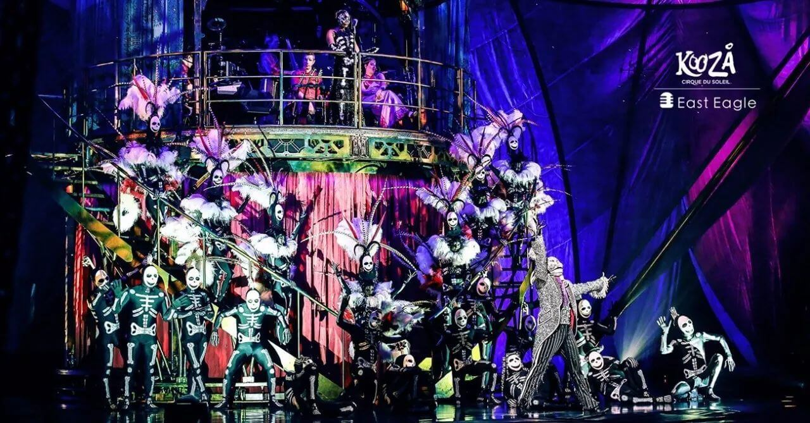
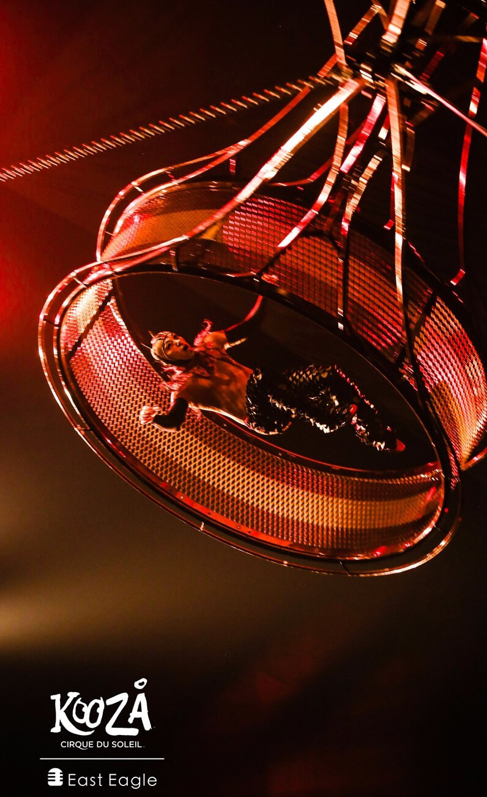
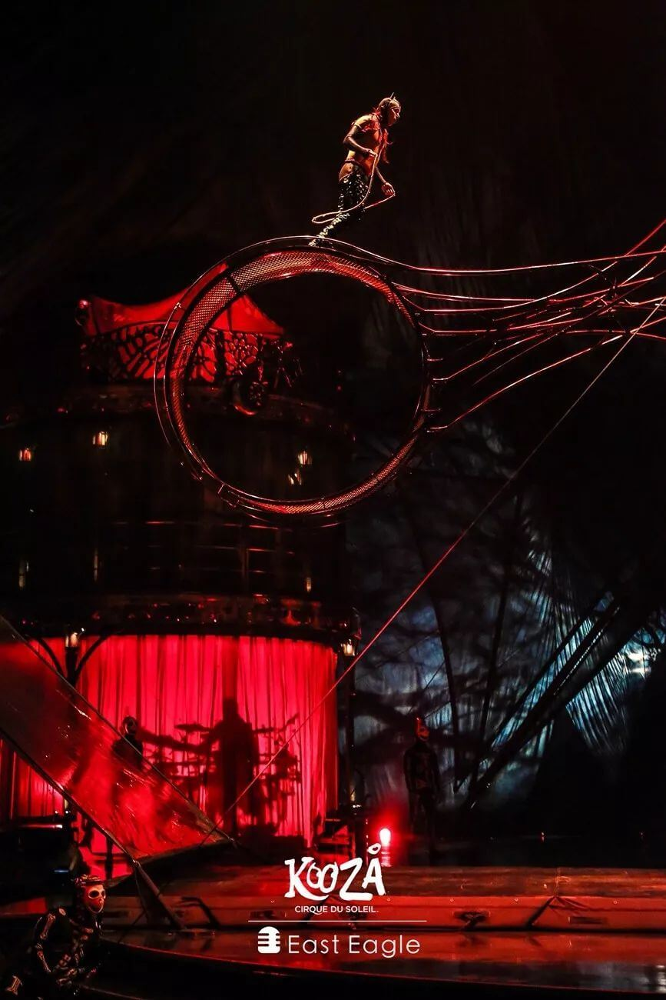
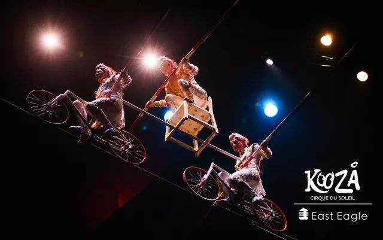
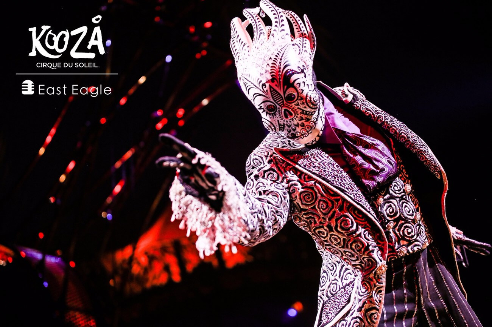

太阳马戏一直深深吸引着我！自从那一年看了一部太阳马戏的电影（[《Cirque du Soleil: Worlds Away 太阳马戏：遥远世界》](https://movie.douban.com/subject/7065120/)），就深深的爱上了！这是一个伟大的艺术，将技巧、技术、想象力发挥得淋漓尽致，每次表演都是一场视听盛宴，一次梦想成真！这次在家门口的大秀怎么能错过。

KOOZA 源于梵文 koza，意为“盒子”、“胸膛”或“财宝”，意在体现“盒子中的马戏”这一基本创作理念。演出一开始，魔幻师（Trickster）从整人玩偶盒中一跃出现在小天真（The Innocent）面前，随后会有更多惊喜接踵而至。小天真在旅程中将遇到许多服饰艳丽的滑稽角色，诸如国王（King）、魔幻师、Heimloss、讨人厌的旅行者（Obnoxious Tourist）和他的恶狗（Bad Dog）等等。

!> 为表达对表演者的尊重，我没有拍摄任何照片，以下照片均来自网络。

这次唯一的遗憾就是，我们看到的是剧情有删减的，不是完整剧情，有机会一定要去美国拉斯维加斯看！

