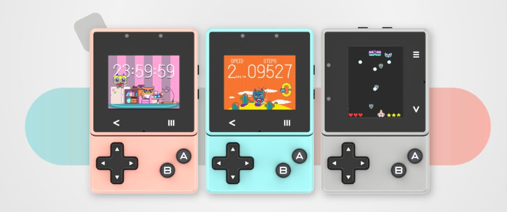
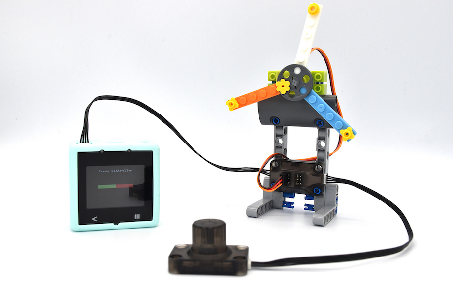

Xtron Pro 是以编程教育为出发点研发的掌上游戏机，它支持通过 [MakeCode Arcade](https://arcade.makecode.com/) 或 [Xmaker](https://xmaker.ovobot.cc/)（MakeCode Arcade 的定制版）进行图形编程或 Python 编程，不但能执行游戏程序，还能搭配多种传感器模块使用，适合让小朋友从动手做的过程中学习编程与物联网设备开发。

## 开箱体验

开箱给人的第一感觉是精致、简洁、小巧。作为一款教育产品，没有多余花哨的东西，非常符合产品的定位。贴纸作为现在科技产品的标配，感觉有用又没啥用。简单的说明书简单到不看也罢，注意一下里面的二维码和网址就够了。

再来细品一下 Xtron Pro，设备质感有一点不上档次，看上去像是廉价的塑料，接缝很宽、很明显，按键有点硬。设备由两部分组成：核心模块和控制手柄模块，两个模块使用磁吸的方式连接。配件上，USB 线没什么好说的，中规中矩；核心模块的硅胶套非常粗糙，套上硅胶套就可以做智能手表。

### 官方宣传动图

### 产品数据

| 规格         | 描述                                     |
| ------------ | ---------------------------------------- |
| **处理器**   |
| 型号         | STM32F4                                  |
| 频率         | 100MHz                                   |
| SRAM         | 256KB                                    |
| Flash        | 1MB                                      |
| **储存**     |
| 容量         | 128M-bit                                 |
| 频率         | 133MHz                                   |
| **时钟芯片** |
| 型号         | DS1330                                   |
| 电池         | 0.3F 超级电容                            |
| **传感器**   |
| 型号         | MPU6887                                  |
| 陀螺仪范围   | +/- 2000 °/s                             |
| 重力加速范围 | +/- 16g                                  |
| **屏幕**     |
| 类型         | TFT                                      |
| 尺寸         | 1.8"                                     |
| **无线模块** |
| 型号         | ESP32                                    |
| PSRAM        | 64M-bit                                  |
| Flash        | 16M-bit                                  |
| **扬声器**   |
| 类型         | 动圈式                                   |
| 功率         | 0.7W                                     |
| **话筒**     |
| 型号         | 4015                                     |
| 灵明度       | -30dB                                    |
| 指向性       | 全向                                     |
| **其他**     |
| 按键         | 2 个触摸按键，8 物理按键                 |
| 震动马达     | 14000 rpm                                |
| 接口         | USB-C，4PIN Port，8PIN Pogopin，耳机接口 |
| 电池         | 锂聚合物电池, 500mAh                     |
| 尺寸         | 82 x 53 x 22 mm                          |
| 重量         | 70g                                      |

## 自制游戏

Xtron Pro 的显着特征之一是它是完全可编程的，孩子们可以使用 [MakeCode Arcade](https://arcade.makecode.com/) 或 [Xmaker](https://xmaker.ovobot.cc/) 对设备进行任意编程，编程软件包含预先编写的代码块和图像资源，以帮助任何新手了解编程及其功能，支持图形编程以及 JavaScript 和 Python 编程语言。

借助编程软件，孩子们可以学习编写自己的游戏，并将自己设计的游戏传输到 Xtron Pro 执行，使用内建 16MB 记忆体，支持从菜单选择、启动多款游戏、程式，提升操作的方便性。

除了自制设计的游戏外，该设备还支持俄罗斯方块或大金刚等复古 NES 游戏。此外，如果有多个 Xtron Pro 设备，则可以通过数据线将它们连接起来，以享受一些多人游戏的动作，就像街机时代一样。

## 物联网

[Xmaker](https://xmaker.ovobot.cc/) 加入了许多专为 Xtron Pro 设计的智能手表、IoT 装置、语音辨识等功能，让没有编程基础的入门者也可以快速上手。

Xtron Pro 内建动态感应器、Wi-Fi 通讯、麦克风、喇叭、震动器等元件，并可搭配超音波测距、旋钮、土壤湿度侦测、伺服马达、触控与 LED、数字显示器等多种模块，透过程序接受数据并进行互动，增加 Xtron Pro 的功能，并让孩子们熟悉如何使用这些模块创造出更多新奇的东西。

