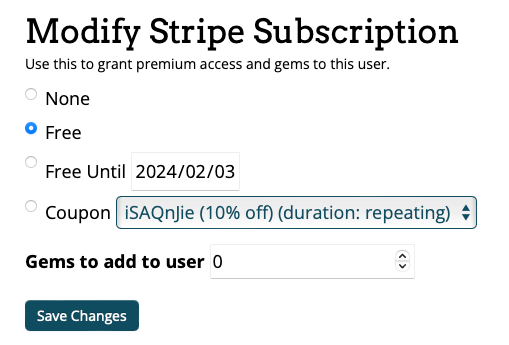

近来计划教儿子学习编程——虽说有点早。他最近喜欢闯关和地下城风格的游戏，所以就想到 CodeCombat 这个编程游戏，于是便开始了准备在家架设一个服务器。因为之前弄过 Docker 版本的，于是想直接用上，但是不想在本机上运行服务器，正好手头上有一块[CB1](/2022/1024/)可以运行 Linux，正好用做服务器运行。


说干就干，上电后就开始下载 CodeCombat。可是一瓢冷水倒下来，原来我是基于 x86 框架的芯片建的 Docker，可 CB1 是基于 ARM64 的，完全不能兼容，只能从头新建一个。

重建过程曲折，不多说了，直接[分享](https://pan.quark.cn/s/4b546573f866 "提取码：CSNc")（提取码：CSNc），分享的是打包的数据文件夹，用官方的 `mongodb/mongodb-community-server:4.4.5-ubi8` 和 `node:6.17.1` 两个镜像并映射好数据文件夹就可以了。

!> 首先在服务器上安装好支持 ARM64 的 Docker，然后在电上脑使用 SSH 远程登录到服务器。

## 操作步骤

1. 解压数据文件

   ```bash
   tar -xvf codecombat.tar -C /home/<USER>
   ```

2. 运行容器

   ```bash
   docker run -d --name codecombat-db --restart=unless-stopped -u <UID> -p 27017:27017 -v /home/<USER>/codecombat/db:/data/db mongodb/mongodb-community-server:4.4.5-ubi8
   docker run -d -t --name codecombat --restart=unless-stopped -p 3000:3000 -v /home/<USER>/codecombat:/root/codecombat -e COCO_MONGO_HOST=172.17.0.1 -e COCO_MONGO_ANALYTICS_HOST=172.17.0.1 -w /root/codecombat node:6.17.1 sh -c "npm run nodemon"

   ```

   `--restart=unless-stopped` 参数可以保证每次服务器重启都会自动启动容器。

   !> 如果服务器还没有 `mongodb/mongodb-community-server:4.4.5-ubi8` 和 `node:6.17.1` 镜像，Docker 会自动下载，请保证网络畅通，并耐心等待下载完成。

3. 现在用你的电脑打开浏览器，输入服务器地址，开心的玩吧。例如，服务器地址 `192.168.1.100`，输入网址 `http://192.168.1.100:3000/play`

## 游戏管理

!> 管理员账号：yeqin，管理员密码：gong

使用管理员账号登录后，进入管理页面就可以对其他账号进行授权管理，输入其他账号名，然后查找再授权，就可以给任何账号加金币或开通永久免费权限：


输入要授权的用户名（先自行注册一个用户名），然后点击搜索，在点击用户的那串长长的 ID，进入授权页面，并入下图设置好，就可以永久免费游戏了：



## 最后

好了，这样就可以用你的基于 ARM64 的开发板（例如这派那派的）做服务器，在局域网内开设一个 CodeCombat 编程游戏服务器了。局域网内可以多个玩家（不建议太多，否则需要更高性能服务器）进入。

!> 如果不想自己弄，也可以找我购买装好 Docker 的开发板，插上电就可以用。
