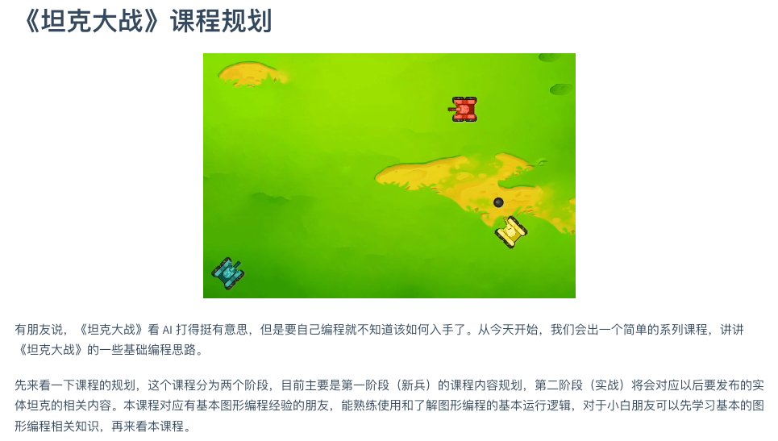

为了让更多人能愉快的体验编程游戏——[《坦克大战》](https://make.blockcode.fun/)，计划编写了一个简单的课程——“[坦克训练营](https://lab.blockcode.fun/#/2024/0205-1/ "《坦克大战》课程规划")”，整套课程会在 [BlockCode Lab](https://lab.blockcode.fun/) 的博客上连载，现在已经出了[第一课：坦克的移动和开火](https://lab.blockcode.fun/#/2024/0205-2/ "坦克训练营1 - 坦克的移动和开火")。

[打开课件](https://lab.blockcode.fun/#/2024/0205-2/slide/1 ":class=button")

